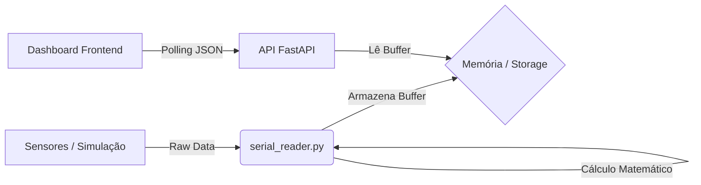

# 🏎️ Sistema de Telemetria FSAE EV (Full Stack)

Este projeto implementa uma solução completa de telemetria para um veículo Fórmula SAE Elétrico. O sistema engloba desde a captura de dados (via Serial/STM32 ou Simulação), processamento matemático no backend, até a visualização em tempo real em um dashboard de alto desempenho.

O foco principal é a baixa latência, confiabilidade dos dados e robustez contra falhas de conexão ou interrupções do navegador.

## 🧠 Arquitetura do Sistema

O projeto foi desenhado para desacoplar a aquisição de dados da visualização, garantindo que o processamento matemático não dependa da performance do navegador do cliente.

### Fluxo de Dados



## Decisões Técnicas Críticas

### 1. Cálculo no Backend vs. Frontend

Optou-se por realizar a integração matemática (Cálculo de Distância Total e Energia Consumida) no Python, e não no JavaScript.

- **O Problema**: Navegadores modernos aplicam *throttling* (redução de velocidade) em abas que não estão em foco, alterando o `setInterval` de milissegundos para até 1 minuto. Isso destruiria a precisão da integração (`dist += vel * tempo`).
- **A Solução**: O script Python roda em processo separado com clock estável. Se o navegador for fechado ou recarregado, a telemetria não perde o histórico da sessão.

### 2. Proteção contra "Reload Loop"

Durante o desenvolvimento, identificou-se que ferramentas como o VS Code Live Server forçam o recarregamento da página sempre que o backend salva um log (.csv ou .json).

**Solução**: A arquitetura final exige que o frontend seja aberto via protocolo de arquivo (`file:///`) ou servidor estático simples, isolado do sistema de arquivos monitorado.

### 3. Tratamento de JSON Polimórfico

Para garantir compatibilidade com diferentes versões da API (FastAPI/Pydantic), o Frontend implementa um parser híbrido:

- Aceita dados planos: `{ "speed": 50 }`
- Aceita dados aninhados: `{ "data": { "speed": 50 } }`

Isso impede "erros silenciosos" onde os gráficos parariam de atualizar caso a estrutura da API mudasse.

## 🔌 Modos de Operação: Simulação vs. Hardware Real

O sistema opera em dois modos distintos, configuráveis via código.

### 1. Modo Simulação (Sem STM32)

Permite testar todo o fluxo (Backend, API, Frontend) sem hardware conectado. O sistema gera pacotes virtuais com comportamento físico realista.

**Como ativar:**

No arquivo `serial_reader.py`:
```python
SIMULATION = True
```

### 2. Modo Porta Serial Real (STM32 / LoRa)

Conecta-se à porta COM física para ler dados reais do veículo.

**Como ativar:**

No arquivo `serial_reader.py`:
```python
SIMULATION = False
PORT = "COM3"     # Ajuste para a porta do seu sistema (ex: /dev/ttyUSB0 no Linux)
BAUD = 115200     # Deve corresponder ao firmware do STM32
```

## 📂 Estrutura do Projeto e Responsabilidades

| Arquivo | Componente | Descrição |
|---------|------------|-----------|
| `serial_reader.py` | Core / Backend | Responsável pela leitura Serial ou Simulação, e cálculos matemáticos (integração). |
| `main.py` | API | Servidor FastAPI que expõe os dados para o Frontend. |
| `parser.py` | Utils | Converte strings brutas (raw) em dicionários estruturados. |
| `storage.py` | Banco em Memória | Buffer circular (FIFO) que mantém os últimos 5000 registros. |
| `index.html` | Frontend | Estrutura semântica do Dashboard (KPIs, Gráficos, Status Bar). |
| `script.js` | Frontend Logic | Gerencia o polling de dados, parser JSON e atualização do DOM. |
| `style.css` | Styling | Layout CSS Grid responsivo e lógica visual dos LEDs. |

## 📊 Detalhes do Frontend (Dashboard)

A interface foi construída para latência zero utilizando Chart.js com configurações específicas:

- **Renderização**: Uso de `maintainAspectRatio: false` para obrigar o Canvas a respeitar o CSS Grid.
- **Performance**: Buffer circular visual (`maxPoints: 50`) para evitar vazamento de memória no navegador.
- **Animação**: Desativada (`animation: false`). Em telemetria, a interpolação visual causa atraso na percepção; o dado na tela é o dado bruto instantâneo.
- **LEDs**: Indicadores de estado (BMS, IMD, Freios) feitos puramente em CSS (`box-shadow`), sem uso de imagens pesadas para carregamento instantâneo.

## 🚀 Como Rodar (Modo Produção)

Para garantir estabilidade máxima e evitar recarregamentos automáticos indesejados, siga esta ordem estrita de execução:

### Passo 1: Iniciar o Core (Backend)

Este script vai gerar ou ler os dados e realizar os cálculos.

```bash
python serial_reader.py
```

### Passo 2: Iniciar a API

Levante o servidor de dados. **Importante**: Não use a flag `--reload` para evitar reinícios ao salvar logs.

```bash
uvicorn main:app
```

### Passo 3: Abrir o Dashboard

Não utilize extensões como "Live Server". Abra o arquivo diretamente pelo navegador.

1. Vá até a pasta do projeto.
2. Dê duplo clique em `index.html`.
3. O endereço será algo como: `file:///C:/Users/SeuUsuario/Projeto/index.html`

## 🛠️ Manutenção e Expansão

- **Banco de Dados**: Atualmente utiliza buffer em memória. O design modular do `storage.py` permite migração fácil para SQLite ou InfluxDB.
- **Novos Sensores**: Para adicionar sensores, atualize apenas o `parser.py` e o Frontend; a lógica de transporte de dados permanecerá intacta.